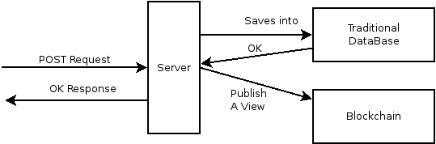

# Blockchain database and service usage in an existing project | Proof of concept

## Introduction

The project tries to get closer the actual projects in the market and the emerging technology blockchain.

## Goals

The project aims to use the blockchain for the next use cases:

### Distributed database

Delegate the read operations of data to the blockchain for decrease the load of our servers.

### Payment System

Use the blockchain as a payment system.

In addition, we want to present some metrics and side-effects of this project that could help us to decide if the blockchain is worth to be used or not.
* Fast data propagation between continents: Write data at Europe and Read at North America
* Extract cost metrics: Cost per user
* Extract deploy time

## Toolset

* Java 8
* [Spring Boot](https://spring.io/)
* [Parity](https://ethcore.io/parity.html)

## Which blockchain?

### Ethereum | Public blockchain

Ethereum is a public blockchain, featuring smart contract functionality.

[Wikipedia entry](https://en.wikipedia.org/wiki/Ethereum)  
[Official webside](https://www.ethereum.org/)  
[GitHub](https://github.com/ethereum)  

### Hyperledger fabric | Private blockchain

Hyperledger is a cross-industry collaborative effort, started by the Linux Foundation, to support blockchain-based distributed ledgers.

One of the projects is Fabric.
The fabric is an implementation of blockchain technology that is intended as a foundation for developing blockchain applications or solutions. It offers a modular architecture allowing components, such as consensus and membership services, to be plug-and-play. It leverages container technology to host smart contracts called “chaincode” that comprise the application logic of the system.

[Wikipedia entry](https://en.wikipedia.org/wiki/Hyperledger)  
[Official webside](https://www.hyperledger.org/)  
[Github](https://github.com/hyperledger/fabric)  
